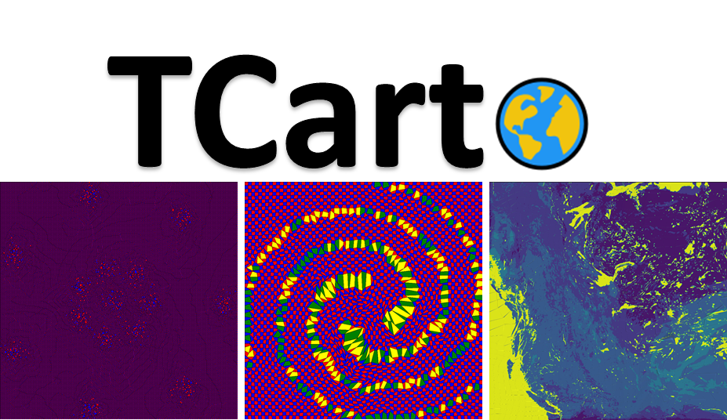
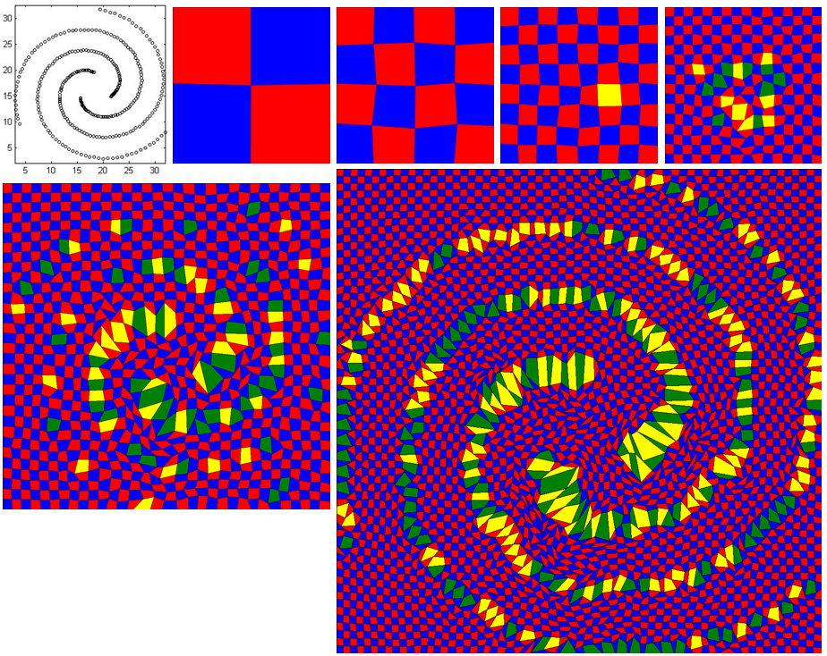
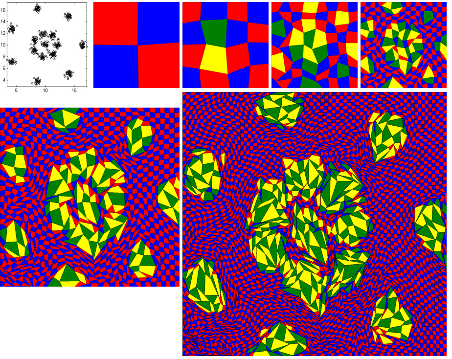
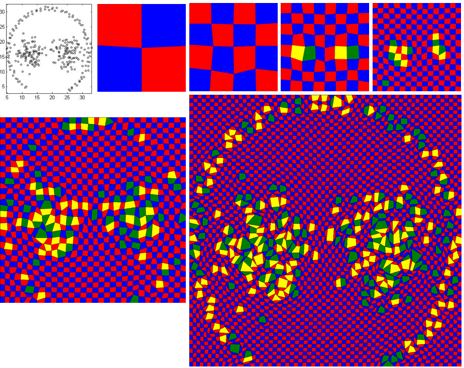
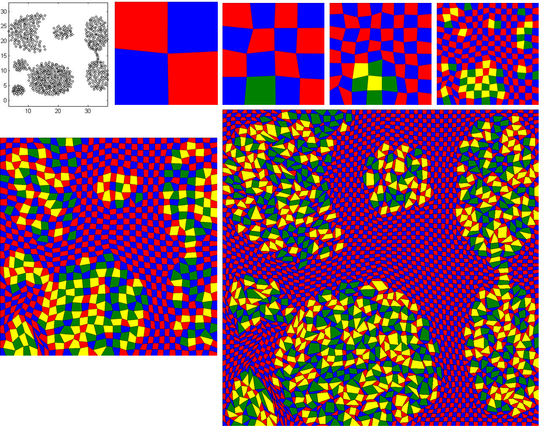

<!-- -->
[]()

TCarto is a simple, scalable, parallel code optimization for Table Cartograms.
We present a table cartogram generator written in python. It uses local optimization based approach to construct table cartogram that gradually transforms the cells to improve the area discrepancies.

This readme explains how to set-up and use this code as well as the Dataset Description and input data format.

# Dataset Description
We have build a rich database containing both Real-life and Synthetic Datasets of different grid sizes.

## Real-life Dataset
One Real-life Dataset is the `car' dataset, which is one of the commonly used dataset for infographic examples. The other one is Weather Research and Forecasting (WRF) model output for five weather parameters Soil Moisture (SMOIS), Surface Skin Temperature (TSK), Planetary Boundary Layer Height (PBLH), Soil Liquid Water (SH2O) and Surface Emissivity (EMISS). This geospatial dataset spans the western provinces of Canada. All these datasets are analyzed in 64x64 grids.

## Synthetic Dataset
We generated a synthetic dataset using the ELKI data mining frameworks, which is one of the widely used software for clustering and generating cluster datasets with user specified distribution. Our motivation for using synthetic data was to examine data characteristics that may influence the cartographic accuracy of a table cartogram. Hence we found ELKI to be an excellent choice for generating synthetic data. Our ELKI dataset contains two sets: (Set-I) varies the cluster number (2,4,8), and (SET-II) varies the standard deviation $\sigma$ (0.25,0.5,0.75). The other input parameters are chosen at random. For each group (e.g., 4 clusters in Set-I), we generate 10 instances. All the instances are two dimensional and the clusters have a Gaussian distribution in both dimensions. The ELKI datasets are in 8x8, 16x16, 32x32 and 64x64 resolution.

We also used a benchmark `Shape' dataset to see whether table cartograms preserve various shapes. All the shape datasets are in resolution 8x8, 16x16, 32x32, 64x64, 128x128, 256x256 and 512x512.


# Input Data Format:
This code expect only one input data file. We suggest to unzip Datasets.zip and put it in the same directory. Please, copy the data file you are interested into 'input' folder and always generate output into 'output' folder. The only input data file is a (.txt) file that holds the weights/area values of the grids/cells of the cartogram. For example, an input data file (e.g. D31_cluster_31_grid_2_2.txt, located at '\Datasets\Synthetic Datasets\Shape Dataset' folder) is for a 2 by 2 grid cartogram. It holds data similar like below.

1.0916129032,0.9161290323,

0.8670967742,1.1225806452

It means the targeted weights or area values of the output 2x2 cartogram would be 1.0916, 0.9161, 0.8671 and 1.1226 for top left, top right, bottom left and bottom right cell/grid respectively.

# Set-up and dependencies:
1. Python 3.7 or higher version should be installed. You can download it from here: https://www.python.org/downloads/
2. MiniConda3 or Conda 4.6 or higher version should be installed.
3. Install 'CVXOPT' by using 'pip install cvxopt' or 'conda install -c conda-forge cvxopt'
4. Install 'Sympy' by using 'pip install sympy'
5. Install 'Pillow' by using 'pip install Pillow'
6. Install 'matplotlib' using 'conda install -c conda-forge matplotlib'

# Running code and generating cartogram:

1. Unzip Datasets.rar
2. Copy the interested data file inside from 'Datasets' folder to the 'input' folder. For example, copy 'PBLH_grid64_64.txt' file from 'Datasets\Datasets_checked\Real-life Dataset\' folder to 'input' folder.
3. Navigate (using terminal on Linux/Ubuntu and command prompt on Windows) to the directory with the TCarto root directory.
4. Run the executable using the following command
'python <python_file_of_expected_algorithm> <number_of_squared_grid> <input_data_file> <output_log_and_image_filename>
for example, 'python PrescribedAreaDrawingDivideConq.py 64 "input/PBLH_10_new_grid64_64.txt" "DivCon_PBLH_10_new_grid64_64"'

python_file_of_expected_algorithm -> There are two python files here to run : PrescribedAreaDrawingDivideConq.py is for parallel programming with divide and conquer strategy (DIV-CON), PrescribedAreaDrawingDivideConqIMG.py is similar like PrescribedAreaDrawingDivideConq.py but it takes another image file hard codedly inside code, applies DIV-CON technique on top of that image file and provides the output of the distorted image file.

number_of_squared_grid -> Total number of grid for square shape

input_data_file -> A (.txt) file as an input data file having weights of each and every cells of the cartogram

output_log_and_image_filename -> This is just the filename for the output image and output log file

'python <python_file_of_expected_algorithm> <number_of_squared_grid> <number_of_iteration> <input_data_file> <output_log_and_image_filename>
for example, 'python PrescribedAreaDrawingParallelCode.py 64 5 "input/PBLH_10_new_grid64_64.txt" "DivCon_PBLH_10_new_grid64_64"'

python_file_of_expected_algorithm -> PrescribedAreaDrawingParallelCode.py is for parallel programming with two phases (ParallelOPT) and PrescribedAreaDrawing.py is for the single threaded code.

number_of_iteration -> Total number of iteration

5. You can also use script file to run multiple command at the same time.
  - **For windows:** 
    - Write all the commands into 'run_win.cmd' file
    - Double click to execute it
  - **For Linux/Ubuntu:**
    - Write all the commands into 'run_linux.sh' file
    - Make this file as executable by using 'chmod +x run_linux.sh' command
    - Run the file using '.\run_linux.sh'

6. The output image and log files will be generated into the 'output' folder.

# Generating cartogram:

We have run our code for R15 data of 256 by 256 grid and the output has been produced with RMSE = 1.94%. 
- Copy 'r15_cluster_15_grid_256_256.txt' file from 'Datasets/Datasets_checked/Synthetic Datasets/Shape Dataset' folder to 'input' folder
- Then, run below command.
``` r
python PrescribedAreaDrawingDivideConq.py 256 "input/r15_cluster_15_grid_256_256.txt" "DivConq_R15_256_256"
```
- Output log file and image file have been generated into 'output' folder with the name of 'out_log_DivConq_R15_256_256.txt' and 'DivConq_R15_256_256.png' respectively.

<!-- -->

## Highlights of important cells:

Due to the shortage of time, we could not mention this into our paper. The downloaded code will be run without highlighting any important cell.
To activate it with spiral data, follow the below instructions:
- Open 'energyMinimization.py' file and set the value of the variable, 'imp_cell_threshold' from 100 to 1.25. This means the cells having value of 25% higher than its initial value will be highlighted as important cell.
The colors of regular cells are either 'Red' or 'Blue' whereas the colors of highlighted cells are 'Yellow' or 'Green'
- Copy 'spiral_cluster_3_grid_64_64.txt' file from 'Datasets/Datasets_checked/Synthetic Datasets/Shape Dataset' folder to 'input' folder
- Then, run below command.
``` r
python PrescribedAreaDrawingDivideConq.py 64 "input/spiral_cluster_3_grid_64_64.txt" "DivideAndConq_Spiral_64_64"
```
- The stage by stage image will be generated into 'output' folder
- The image is arranged from left to right and from top to bottom. First image shows the actual shape of the data. Second image is stage0 with 2 by 2 grid. Third, forth nad fifth images are the output for 
stage1, stage2 and stage3 respectively. It is difficult to interpret the actual shape of data until this stage.
Bottom row left image is the stage4 image and it has just started to form spiral shape. On last stage, it forms the perfect spiral shape (the larger image).

<!-- -->

### R15 data
The input data file is 'r15_cluster_15_grid_64_64.txt' and follow the above instructions.

<!-- -->

### Pathbased data
The input data file is 'pathbased_cluster_3_grid_64_64.txt' and follow the above instructions.

<!-- -->

### Aggregation data
The input data file is 'Aggregation_cluster_3_grid_64_64.txt' and follow the above instructions.

<!-- -->